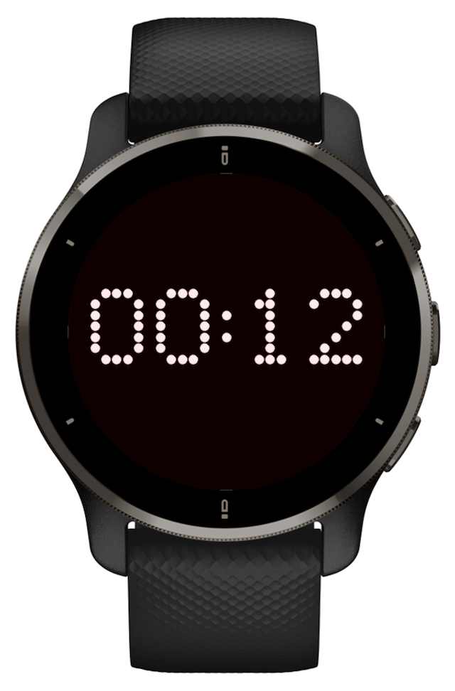
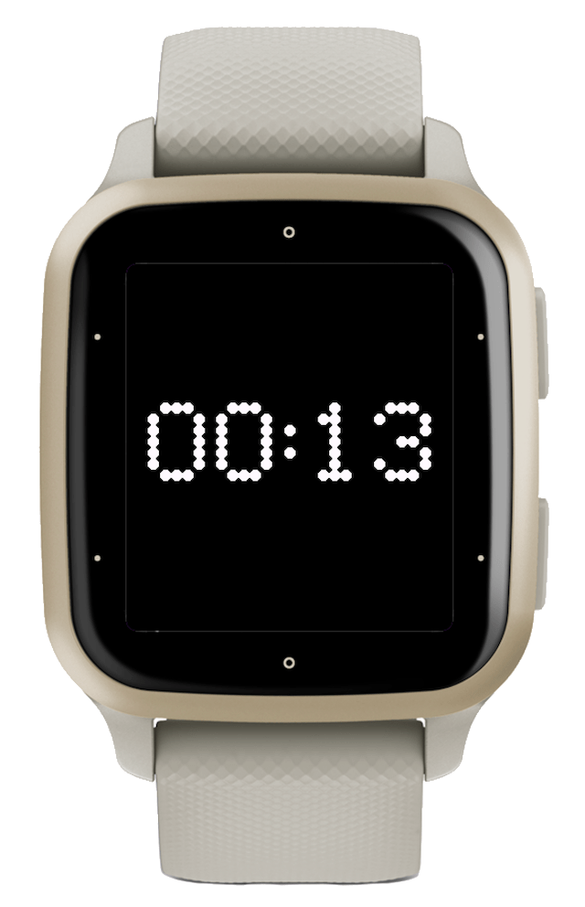
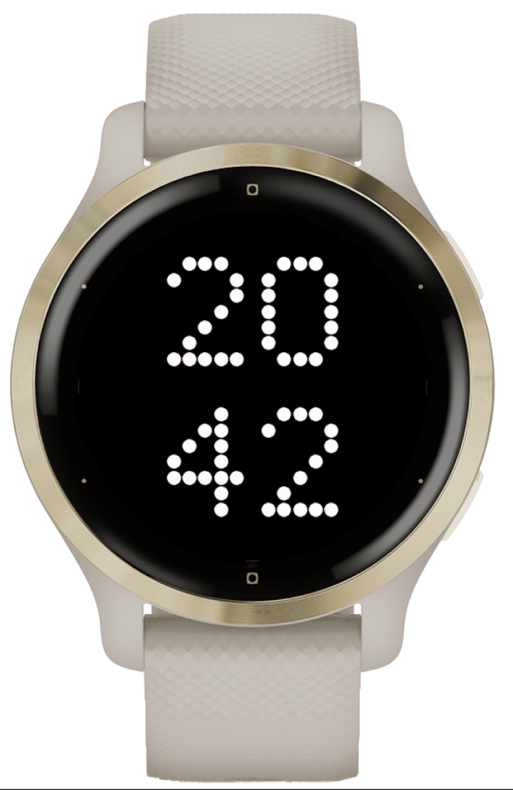

# nothing watch face (1)

## Description 

Nothing Phone (1) inspired watchface. All numbers made from simple dots drawn on canvas, no custom fonts required. Dots size is chosen automatically based on screen size.

[   
](https://apps.garmin.com/en-US/apps/bcce4814-fc01-49f5-9605-1acdb6a0a8cf)

## Build

Use Taskfile to ease cli interface:

|Command|Description|Notes|
|---|---|---|
| `task simulator` | launches Connect IQ simulator | launch it once, no specific device required|
| `task build -- venu2plus` | builds project for spefici device | use .env to specify default or consult manifest for available ones
| `task dev -- venu2plus` | deploy project to device | simulator must be launched for this command to succeed

## Screenshots

| Venu 2 Plus | Venu SQ 2 | Venu 2S |
|:-:|:-:|:-:|
|||

## Versions

### 0.0.3
- New: vertical layout support

### 0.0.1
- Initial watchface implementation